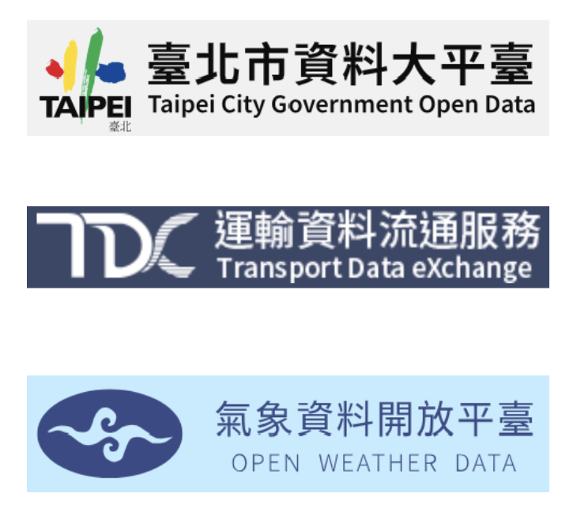

[](https://classroom.github.com/a/HR2Xz9sU)
# [Group5] RideTime: Enhancing Bike Availability Through Statistical Modeling of Usage and Environmental Factors
YouBike in Taiwan faces operational challenges due to uneven bike distribution during peak hours, causing user dissatisfaction. This study uses historical data and predictive models, considering factors like temperature and humidity, to improve bike availability forecasts. Enhanced forecasting allows for better bike redistribution, increasing service reliability and ridership. Optimizing operations can offset over 16,000 tons of CO₂ annually, translating to NT$45 million in carbon credits, thus providing significant environmental and societal benefits.
# poster


## Contributors
|組員|系級|學號|工作分配|
|-|-|-|-|
|林昱安|資科碩一|113753213|負責資料蒐集與整併流程設計，建立 YouBike + 天氣數據管道，確保資料品質與一致性 | 
|陳子昊|資科博一|113761501|建立機器學習模型（RandomForest、XGBoost、LightGBM、CatBoost），進行模型訓練與效能評估|
|謝舜卿|教育碩一|113152012|資料視覺化與報表製作，產出分析圖表（熱圖、時序圖、區域可用性圖），協助 Poster 設計|
|楊智博|資訊四|110703017|撰寫專案自動化流程（scripts/、src/visualization/），協助整體程式架構設計與專案整合|

## Quick start
### 系統需求

- 作業系統：Linux、macOS 或 Windows
- Python：3.8+
- R：4.2+
- 記憶體：建議 8GB 以上
- 網路連線：用於下載 YouBike 即時數據與氣象資料

---

### 安裝步驟

#### 下載專案程式碼

```bash
git clone https://github.com/wenfi123/RideTime-YouBike-Availability.git
cd RideTime-YouBike-Availability
```
## Folder organization and its related description
### code
```
.
├── app                            # Application logic
│   └── services                   # Specific services or feature modules
│       ├── prediction_service.py  # Handles model prediction logic
│       └── r_integration.py       # Python <-> R integration interface 
├── app.R                          # R Shiny app entry point (for visualization)
├── docker-compose.yml             # Multi-container setup (R + Python + database)
├── Dockerfile                     # Docker image build configuration
├── environment.yml                # Conda environment file for Python dependencies
├── R                              # Folder for R scripts
│   ├── analysis.R                 # Data processing, feature engineering, statistical analysis
│   └── plots.R                    # Data visualization (heatmaps, line plots, bar charts)
├── requirements                   # Requirements folders for different environments
│   ├── base.txt                   # Base dependencies
│   └── production.txt             # Production-specific dependencies
├── requirements.txt               # Main Python dependency list
├── notebooks                      # Jupyter or R notebooks for EDA and modeling
│   ├── EDA_notebook.ipynb         # Exploratory Data Analysis notebook
│   └── Modeling_pipeline.ipynb    # Notebook for model training and evaluation
├── src                            # Modular source code
│   ├── data_processing            # Data cleaning, merging, feature engineering scripts
│   ├── modeling                   # Scripts for training and evaluating models
│   ├── visualization              # Scripts to generate project figures
│   └── utils.py                   # Utility functions
├── results                        # Model outputs and visualization results
│   ├── model_outputs              # Saved trained models
│   └── figures                    # Figures included in the poster
├── server.R                       # Backend logic for R Shiny app 
├── scripts                        # General helper scripts (e.g., data download or monitoring)
│   ├── data_collection.py         # Script to automate data collection (YouBike + weather)
│   └── system_analysis.py         # System performance or additional analysis
├── tests                          # Unit tests for Python/R code
├── docs                           # Project documentation
│   ├── folder_structure.md        # Folder organization and description
│   ├── pipeline_description.md    # Detailed description of the data pipeline
│   └── project_poster.pdf         # Final version of the project poster
├── .gitignore                     # Files/folders to ignore in Git
├── README.md                      # Project overview, key findings, folder organization
└── LICENSE                        # License information

---

### Key files and their purposes:
- notebooks/EDA_notebook.ipynb: Exploratory analysis of YouBike & weather data
- notebooks/Modeling_pipeline.ipynb: Full pipeline for feature selection, training, evaluation
- src/modeling: Scripts for training RandomForest, CatBoost, XGBoost, LightGBM
- R/analysis.R: R-based statistical analysis (correlation, ANOVA)
- R/plots.R: R-based visualization (heatmaps, line plots, bar charts)
- results/figures: Figures used in the conference poster
- docs/project_poster.pdf: Final poster file for presentation

```
idea by Noble WS (2009) [A Quick Guide to Organizing Computational Biology Projects.](https://journals.plos.org/ploscompbiol/article?id=10.1371/journal.pcbi.1000424) PLoS Comput Biol 5(7): e1000424.

### docs
[View Final Presentation (PDF)](https://github.com/1132-NCCU-DataScience/finalproject-finalproject_group5-1/blob/main/Final%20Presentation.pdf?raw=true)
  * 


---

## Data Collection

This project integrates multiple data sources to predict bike availability in Taipei’s YouBike system. We collected real-time and historical YouBike station data from **Taipei City Open Data** and **Transport Data eXchange (TDX)**, providing minute-level bike availability and detailed station information. Additionally, we used **OpenWeather** data to obtain hourly records of **temperature** and **humidity**, allowing us to incorporate environmental factors into our models. The dataset spans a **30-day period** from April to May and includes over **5 million observations** of bike activity and **337k weather records**. To merge these sources effectively, we processed timestamps and matched each YouBike station to its nearest weather observation station using the **Haversine distance formula**.
 


---

## Data Processing

After initial collection, the data underwent several processing steps to ensure quality and consistency. We removed rows with missing values, reducing the dataset from over **5 million** to approximately **4.33 million** observations. We then extracted temporal features such as **hour**, **weekday**, and **date**. To better model cyclical patterns in bike usage, both **hour** and **weekday** were encoded using **sinusoidal (sin/cos) transformations**. In addition to time-based features, we included spatial features: **district** and **location name**, which were one-hot encoded to reflect local differences in bike demand. Exploratory analysis highlighted that bike availability varied by district, consistent with variations in land use and station density across Taipei.

---

## Feature Selection

We performed exploratory data analysis to inform our feature selection. Temporal usage patterns showed clear **hourly fluctuations** and differences between **weekdays and weekends**. Moreover, changes in **temperature** and **humidity** correlated with shifts in rental and return patterns — hotter and more humid days generally led to more bikes being rented but fewer being returned. However, individual feature correlations with availability were relatively low, suggesting that **multi-feature modeling** would be necessary. Based on these insights, we selected a set of **temporal (hour, weekday)**, **spatial (longitude, latitude, district, location type)**, and **environmental (temperature, humidity)** features to build our predictive models.

---

## Prediction

We framed the bike availability prediction as a **multi-class classification** task, where the goal is to predict the number of rentable and returnable bikes in intervals of **5-bike units**. We experimented with four **tree-based ensemble models** — **Random Forest**, **CatBoost**, **XGBoost**, and **LightGBM** — using spatial, temporal, climatological, and textual features as inputs. Our evaluation metric was **AUC (Area Under the Curve)**. Results showed that CatBoost consistently achieved the best performance across tasks. Ablation studies demonstrated that **spatial and temporal features alone** provided robust predictive power, though adding **location name** significantly improved results in low-data scenarios. These findings suggest that **tree-based models** are highly effective for operational forecasting in public bike systems, enabling better bike redistribution strategies and contributing to both **user satisfaction** and **environmental impact**.

---

## Impact

This work demonstrates the potential of **data-driven optimization** to improve the efficiency and sustainability of public bike-sharing systems. By enhancing operational forecasting, the models we developed can help increase user satisfaction, reduce operational costs, and contribute to substantial **CO₂ emission reductions** — supporting both **urban mobility** and **environmental goals**.
  This study demonstrates the effectiveness of tree-based ensemble models in predicting YouBike availability using temporal, spatial, and environmental features. By identifying key usage patterns and leveraging high-frequency data, the proposed approach enhances operational forecasting and supports smarter bike redistribution. These improvements not only boost user satisfaction but also contribute to significant environmental and economic gains.

## References
### 📦 R Packages Used

#### Visualization
- [ggplot2](https://ggplot2.tidyverse.org/)
- [ggpubr](https://rpkgs.datanovia.com/ggpubr/)
- [pheatmap](https://cran.r-project.org/web/packages/pheatmap/index.html)
- [ComplexHeatmap](https://jokergoo.github.io/ComplexHeatmap-reference/book/)
- [DiagrammeR](https://rich-iannone.github.io/DiagrammeR/)
- [rpart.plot](https://cran.r-project.org/web/packages/rpart.plot/index.html)

#### Time Series & Date Handling
- [lubridate](https://lubridate.tidyverse.org/)
- [tsibble](https://tsibble.tidyverts.org/)
- [timetk](https://business-science.github.io/timetk/)

#### Statistical Analysis
- [psych](https://cran.r-project.org/web/packages/psych/index.html)
- [car](https://cran.r-project.org/web/packages/car/index.html)
- [broom](https://broom.tidymodels.org/)
- [gt](https://gt.rstudio.com/)
- [kableExtra](https://haozhu233.github.io/kableExtra/)

### Machine Learning Models
- [randomForest](https://cran.r-project.org/web/packages/randomForest/index.html)
- [ranger](https://cran.r-project.org/web/packages/ranger/index.html)
- [catboost](https://catboost.ai/docs/concepts/r-installation-installing-catboost-on-linux.html)
- [xgboost](https://cran.r-project.org/web/packages/xgboost/index.html)
- [lightgbm](https://github.com/microsoft/LightGBM/tree/master/R-package)

### Model Evaluation
- [yardstick](https://yardstick.tidymodels.org/)
- [ROCR](https://cran.r-project.org/web/packages/ROCR/index.html)
- [pROC](https://cran.r-project.org/web/packages/pROC/index.html)

### Data Manipulation
- [dplyr](https://dplyr.tidyverse.org/)
- [tidyr](https://tidyr.tidyverse.org/)
- [data.table](https://cran.r-project.org/web/packages/data.table/index.html)

* Lai, W.-A. (2024) 未來騎YouBike 既環保又可以賺錢. Taiwan Carbon Sustainability and Innovation Foundation. https://www.tcsif.org/news_detail/TCSIF-NEW11
